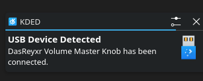
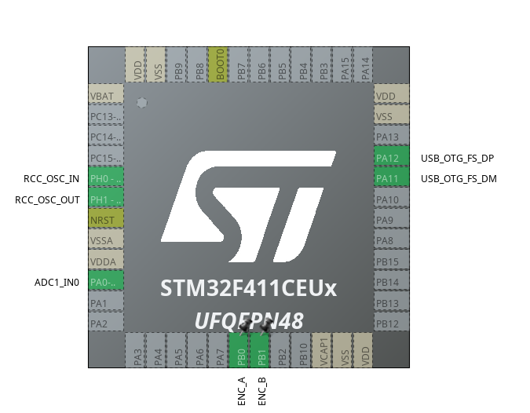

# 11USB_Device: Controlador de Volumen Multimedia (Potenciómetro e Hid-Encoder)

Este proyecto implementa un periférico de control de audio USB nativo utilizando una placa de desarrollo **STM32 Black Pill (STM32F411CEU6)**. El firmware permite alternar entre dos modos de control de hardware independientes (un potenciómetro analógico o un encoder rotativo mecánico) para enviar comandos multimedia estándar (`Volume Up` y `Volume Down`) a sistemas operativos basados en Linux (probado en Manjaro/PipeWire) o Windows mediante la pila **USB Device Class (HID)**.

---

## 🚀 Características

- **Dispositivo Compuesto USB-HID:** Reconocido nativamente sin necesidad de drivers externos.
- **Doble Entrada de Control:** Lógica condicional por preprocesador para alternar fácilmente entre potenciómetro de precisión o encoder rotativo (EC11).

---

## 🛠️ Requisitos de Hardware

- **Placa de Desarrollo:** STM32F401 / STM32F411 (Black Pill) con cristal oscilador externo de 25 MHz.
- **Opción A (Potenciómetro):** Potenciómetro lineal de 10k $\Omega$ conectado al pin `PA0` (ADC1_IN0).
- **Opción B (Encoder Rotativo):** Encoder mecánico EC11 con canales A y B conectados a los pines `PB0` y `PB1` (configurados con resistencias internas de Pull-Up).

---

## Modificaciones en Middlewares 
El process ID asignado debe ser el siguiente
```c
define USBD_PID_FS     0x5740
```
El descriptor de reporte USB HID ha sido modificado y reducido de los 74 bytes originales (Mouse estándar) a **27 bytes** optimizados para emular un teclado multimedia de control de consumo:

```c
__ALIGN_BEGIN uint8_t HID_MOUSE_ReportDesc[27] __ALIGN_END = {
    0x05, 0x0C,          // USAGE_PAGE (Consumer Devices)
    0x09, 0x01,          // USAGE (Consumer Control)
    0xA1, 0x01,          // COLLECTION (Application)
    0x85, 0x01,          //   REPORT_ID (1)
    0x09, 0xE9,          //   USAGE (Volume Increment)
    0x09, 0xEA,          //   USAGE (Volume Decrement)
    0x15, 0x00,          //   LOGICAL_MINIMUM (0)
    0x25, 0x01,          //   LOGICAL_MAXIMUM (1)
    0x75, 0x01,          //   REPORT_SIZE (1)
    0x95, 0x02,          //   REPORT_COUNT (2)
    0x81, 0x02,          //   INPUT (Data,Var,Abs)
    0x95, 0x06,          //   REPORT_COUNT (6) - Relleno (Padding) para completar el byte
    0x81, 0x03,          //   INPUT (Cnst,Var,Abs)
    0xC0                 // END_COLLECTION
};
```
# Device recognized on linux
Device recognized on linux as a USB HID device. The device is a custom USB HID device that sends volume up and volume down commands to the host computer.


## IOC Configuration
The project is configured using STM32CubeIDE. The IOC file is included in the project and can be opened with STM32CubeIDE to view the configuration.

## DEMO
