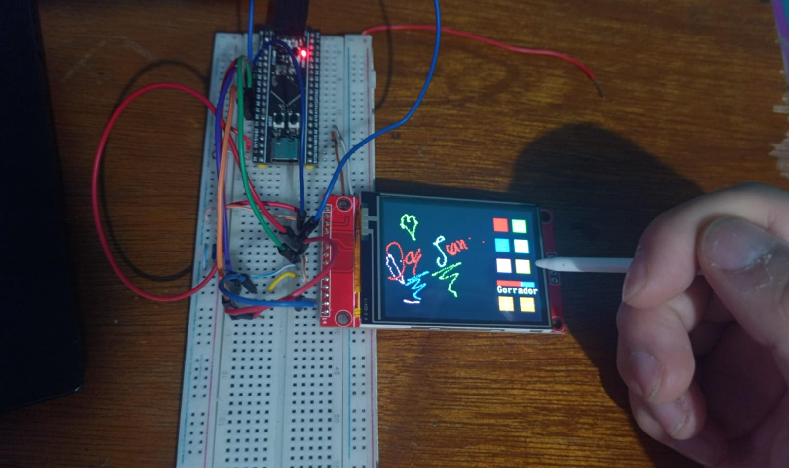

# 12 TouchScreen ILI9341 + XPT2046 Touch Pinout
## STM32F411 BlackPill

Configuración:
- LCD ILI9341 por SPI
- Touch resistivo XPT2046 por el mismo bus SPI
- STM32 configurado como SPI Master Full Duplex
- CS independientes para LCD y Touch

---

## SPI Bus (Compartido)

| STM32F411 | SPI | ILI9341 LCD | XPT2046 Touch | Función |
|---|---|---|---|---|
| PA5 | SPI1_SCK | SCK | T_CLK | Reloj SPI |
| PA6 | SPI1_MISO | SDO | T_DO | Datos recibidos |
| PA7 | SPI1_MOSI | SDI | T_DIN | Datos enviados |

---

## LCD ILI9341

| Pin LCD | STM32F411 | Función |
|---|---|---|
| VCC | 3.3V | Alimentación |
| GND | GND | Tierra |
| CS | PA4 (ejemplo) | Chip Select LCD |
| RESET | PA2 (ejemplo) | Reset LCD |
| DC | PA3 (ejemplo) | Data/Command |
| SCK | PA5 | SPI Clock |
| SDI (MOSI) | PA7 | SPI MOSI |
| SDO (MISO) | PA6 | SPI MISO |
| LED | 3.3V | Backlight |

---

## Touch XPT2046

| Pin Touch | STM32F411 | Función |
|---|---|---|
| T_CS | PA10 | Chip Select Touch |
| T_CLK | PA5 | SPI Clock |
| T_DIN | PA7 | SPI MOSI |
| T_DO | PA6 | SPI MISO |
| T_IRQ | PA9 | Touch interrupt |

---

## Demo

# Resources
https://cdn-shop.adafruit.com/datasheets/ST7735.pdf
https://tams.informatik.uni-hamburg.de/lectures/2023ss/vorlesung/es/doc/ST7735R_v1-4.pdf

https://files.chinaaet.com/files/blog/2019/20171113/1000019445-6364619057348172968045385.pdf
https://www.hackster.io/theembeddedthings/embedded-graphics-display-stm32-and-ili9341-tft-integration-0551bb
https://naylampmechatronics.com/blog/26_tutorial-pantalla-tft-tactil-con-arduino.html
https://newhavendisplay.com/content/app_notes/ILI9341.pdf